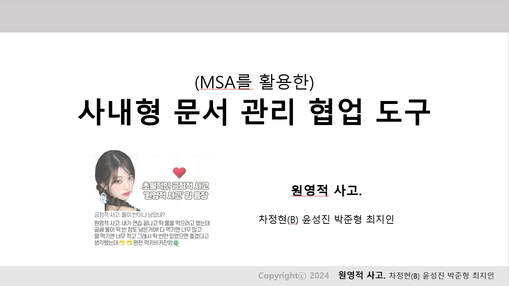
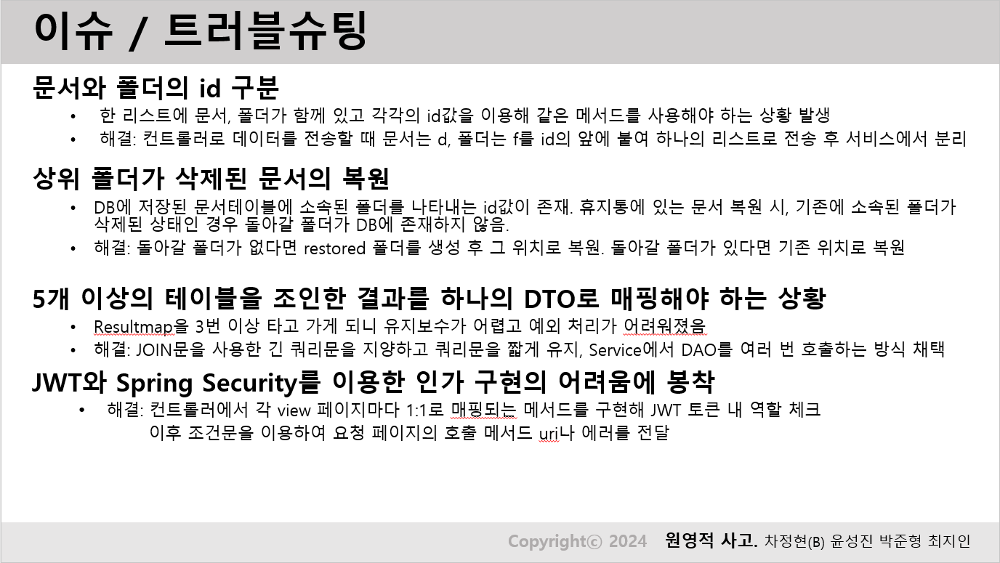

# 사내형 문서 관리 협업 도구

## 프로젝트 개요

- 인원: 4명
- 기간: 2024.05.07 ~ 06.25 (7주)
- CMS는 Content Management System의 약어로, 문서를 작성 및 편집할 수 있는 기능을 제공하는 툴입니다. 회사에서 기술 문서 사이트를 제공해야 하는 경우가 많이 생기고 있는데, 이럴 때 사용할 수 있는 사이트를 만들어보고자 하였습니다.

## 목차

1. [기술 스택](#기술-스택)
2. [팀원 구성](#팀원-구성)
3. [프로젝트 구성](#프로젝트-구성)
4. [분석 설계](#분석-설계)
    - [요구사항 분석](#요구사항-분석)
    - [Use Case 작성](#use-case-작성)
    - [상태전이도 및 배포정책](#상태전이도-및-배포정책)
    - [ERD 다이어그램](#erd-다이어그램)
5. [구현 기능](#구현-기능)
6. [구현 영상](#구현-영상)
7. [이슈 및 트러블슈팅](#이슈-및-트러블슈팅)
8. [리팩토링 계획](#리팩토링-계획)

## 기술 스택

 

## 팀원 구성

### 백엔드
- 차정현: 사원, 프로젝트 관리
- 박준형: 폴더, 휴지통
- 윤성진: 문서 작성, 수정, 상태변경
- 최지인: 대시보드 화면 및 배포

### 프론트엔드
AdminLTE를 이용하여 화면 구성을 하였습니다.

## 프로젝트 구성

## 분석 설계

### 요구사항 분석

개발 기간의 영향으로 필수적인 기능을 제외한, 나머지 몇몇 기능들은 제외되었습니다.

### Use Case 작성

### 상태전이도 및 배포정책
.png>)

### ERD 다이어그램

.png>)

## 구현 기능

[pdf](<Readme Assets/구현 기능.pdf>)

## 구현 영상

## 이슈 및 트러블슈팅

- 동일한 메서드를 이용하여 문서와 폴더를 구분해야 하는 상황 발생. 백엔드로 데이터 전송 시 문서는 `d` 폴더는 `f`를 붙여 전송하여 서비스에서 분리 진행.

- 기존에 소속된 폴더가 삭제된 상태인 경우 복원 시 돌아갈 폴더가 DB에 존재하지 않음. 돌아갈 폴더가 없다면 restored 폴더를 생성 후 그 위치로 복원.

- 테이블을 다수 조인한 결과 JOIN문이 길어져 쿼리문은 짧게 유지하고, 서비스에서 DAO를 여러 번 호출하는 방식을 채택.

- JWT를 이용한 인가 구현의 어려움에 봉착. 각 view 페이지마다 1:1로 매핑되는 메서드로 JWT 토큰 확인.

## 리팩토링 계획

- JWT + Spring Security 이용
- 역할-권한 매핑을 통해 권한 인가
- 부서를 지정한 프로젝트 내 문서 확인
- 클라이언트 계정 추가
- Common Server 도입, DB 분리
